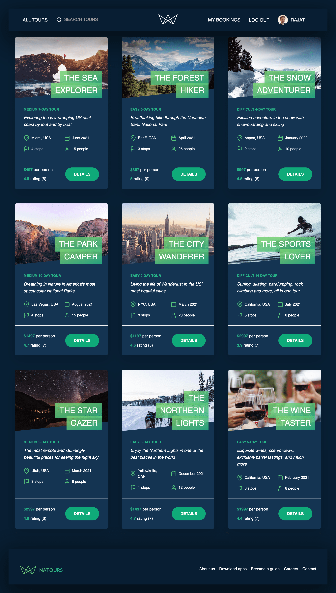
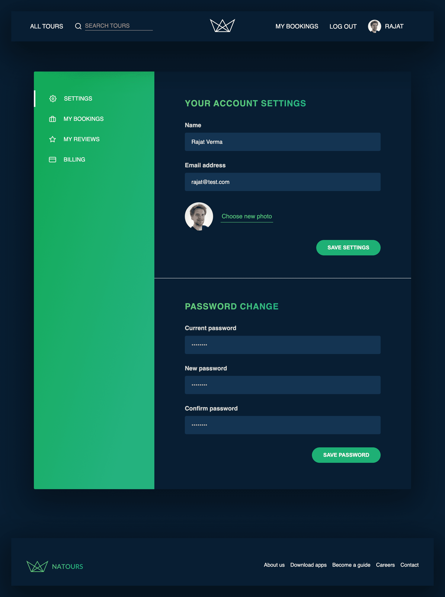
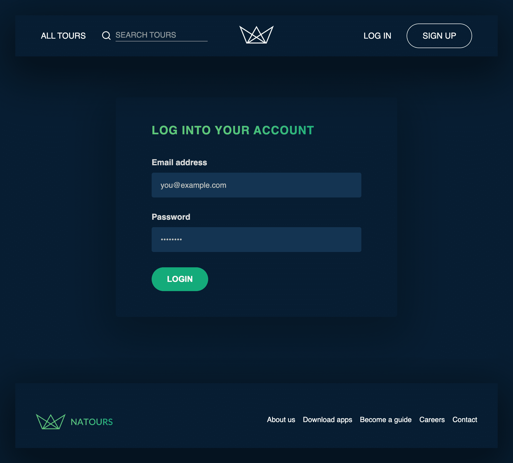
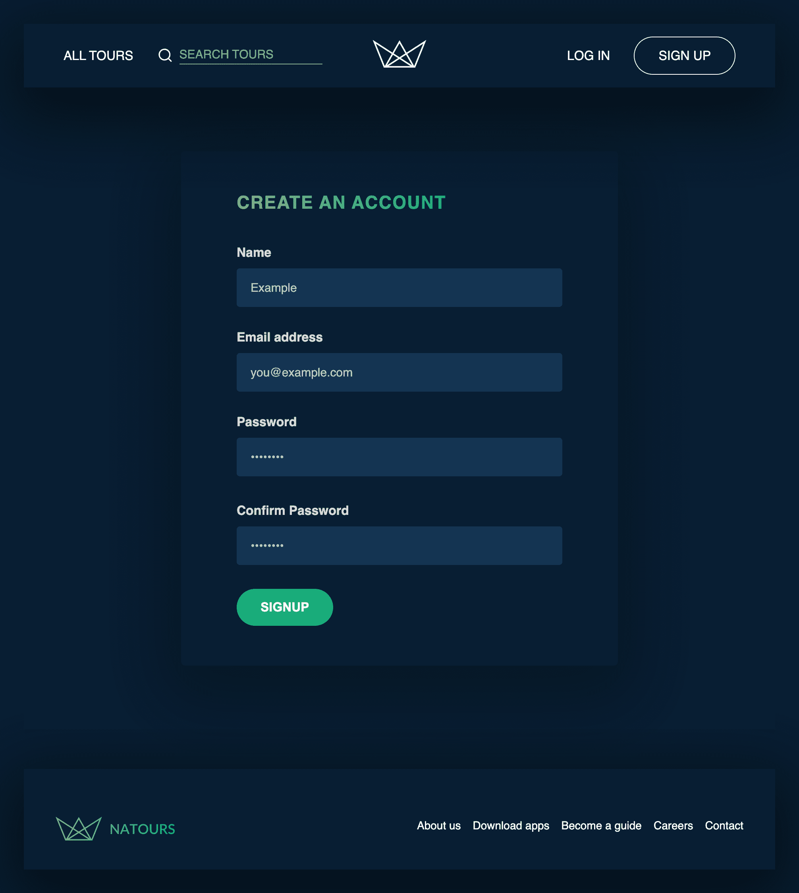

# Adventour - A Server Side Rendered Tour Booking Website

### [👉🏻 Click to see Live Demo 👈🏻](https://adventour.onrender.com/)

## Tech Stack


&nbsp;&nbsp;

&nbsp;&nbsp;

&nbsp;&nbsp;

&nbsp;&nbsp;


&nbsp;&nbsp;

&nbsp;&nbsp;

&nbsp;&nbsp;

### A ficitional Tour booking website made with

> -   NodeJS and ExpressJS
> -   MongoDB and Mongoose
> -   HTML CSS and JavaScript

### Features of the Web App

> -   It is a Server Side Rendered Website having EJS as the view engine
> -   Built the REST (REpresentational State Transfer) API with Node, Express and Mongoose
> -   The WebApp also implements MVC (Model-View-Controller) architecture
> -   Functionality of User Signup, login, reset account password using email is implemented
> -   User can make payment and book tour, see all tours, give reviews on a tour.
> -   Admin can delete, create and get all users, delete, create and get all tours, update and delete reviews
> -   Users can book a tour, update their profile, login , signup

### Some important modules used for Security purpose

```javascript
const rateLimit = require('express-rate-limit');
const mongoSanitize = require('express-mongo-sanitize');
const xss = require('xss-clean');
const hpp = require('hpp');
const crypto = require('crypto');
const jwt = require('jsonwebtoken');
const bcrypt = require('bcryptjs');
```

<!--  const helmet = require('helmet'); -->

> -   Rate Limit is the module used for limiting the no. of requests made by a client to the server.
> -   Mongo Sanitize sanitizes mongodb queries against NOSQL query injections.
> -   XSS modules help us to prevent cross site scripting attacks.
> -   HPP module helps us to prevent attacks against HTTP parameter pollution..
> -   Crypto module used for generating hash token for reset password functionality of the user.
> -   JWT is used for stateless authentication mechanisms for users and providers.
> -   Bcrypt to hash user password and then store them in the database instead of plain password for security purposes.

## Screenshots

-   #### Home Page

    

-   #### Profile Settings Page

    

-   #### Login Page

    

-   #### Signup Page
    

    
